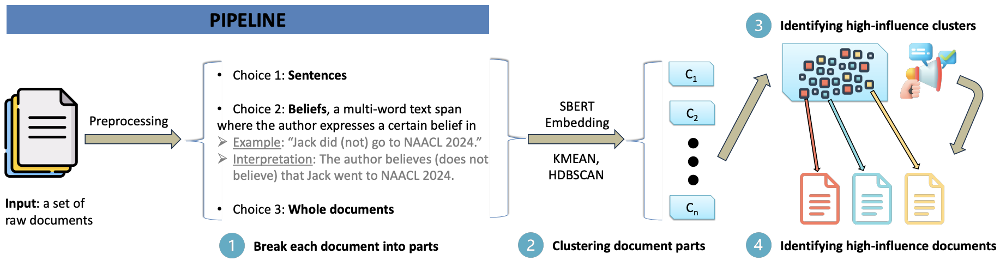

<p align='center'>
 
</p>

### Description

This repo contains code for the paper: [Clustering Document Parts: Detecting and Characterizing Influence Campaigns from Documents](https://aclanthology.org/2024.nlpcss-1.10/), accepted by the [6th Workshop on Natural Language Processing and Computational Social Science (NLP+CSS)](https://sites.google.com/site/nlpandcss/nlp-css-at-naacl-2024). For a quick review of the paper, you can read [the poster](./nlp+css_poster.pdf) included in the repo.

The ``scripts`` folder has code mostly for data preprocessing, belief-tagging, and clustering. The code outside the folder was used for doing the experiments. The file ``main.sh`` logs the experimental procedure. 

The belief tagging system we use comes from this [generative-belief](https://github.com/yurpl/generative-belief) repo. We use the [Linguistic Feature Extractor](https://github.com/jaaack-wang/ling_feature_extractor) to extract the 96 general linguistic features (mostly lexical frequency counts). We modified the LFE program for the purpose of our paper and place the code in the ``LFE`` folder.


### Data

We use data collected during a large research program with [a DARPA INCAS project](https://www.darpa.mil/program/influence-campaign-awareness-and-sensemaking). We expect the data to be made public after the end of the research program. We use this dataset as we are not aware of any other datasets that have expert-verified annotations indicating if a collection of documents contain influence campaigns. 


### Clustering to classification

``sent-level-clustering2classification.ipynb`` is a conceptual demonstrtaion of how we can transform results obtained from clustering into classifying high-influence documents, with or without aggregation, provided that we know what clusters are high-influence clusters. In this demonstration based on results from sentence-level clustering, we use the ground truth label from our data and show that how the approach performns given varying thresholds of the ``alpha``, the percentage of documents that reflect an influence campaign inside a cluster in order for the cluster to be considered as a high-influence cluster. In our paper, we train cluster-level classifiers to detect high-influence clusters. 


### Citation

``````
@inproceedings{wang-rambow-2024-clustering,
    title = "Clustering Document Parts: Detecting and Characterizing Influence Campaigns from Documents",
    author = "Wang, Zhengxiang  and
      Rambow, Owen",
    editor = "Card, Dallas  and
      Field, Anjalie  and
      Hovy, Dirk  and
      Keith, Katherine",
    booktitle = "Proceedings of the Sixth Workshop on Natural Language Processing and Computational Social Science (NLP+CSS 2024)",
    month = jun,
    year = "2024",
    address = "Mexico City, Mexico",
    publisher = "Association for Computational Linguistics",
    url = "https://aclanthology.org/2024.nlpcss-1.10",
    pages = "132--143",
}
``````


### Acknowledgements

We thank three anonymous reviewers from the 6th NLP+CSS Workshop for the constructive and helpful comments. This material is based on work supported by the Defense Advanced Research Projects Agency (DARPA) under Contracts No. HR01121C0186, No. HR001120C0037, and PR No. HR0011154158. Any opinions, findings and conclusions or recommendations expressed in this material are those of the authors and do not necessarily reflect the views of DARPA. Rambow gratefully acknowledges support from the Institute for Advanced Computational Science at Stony Brook University.
